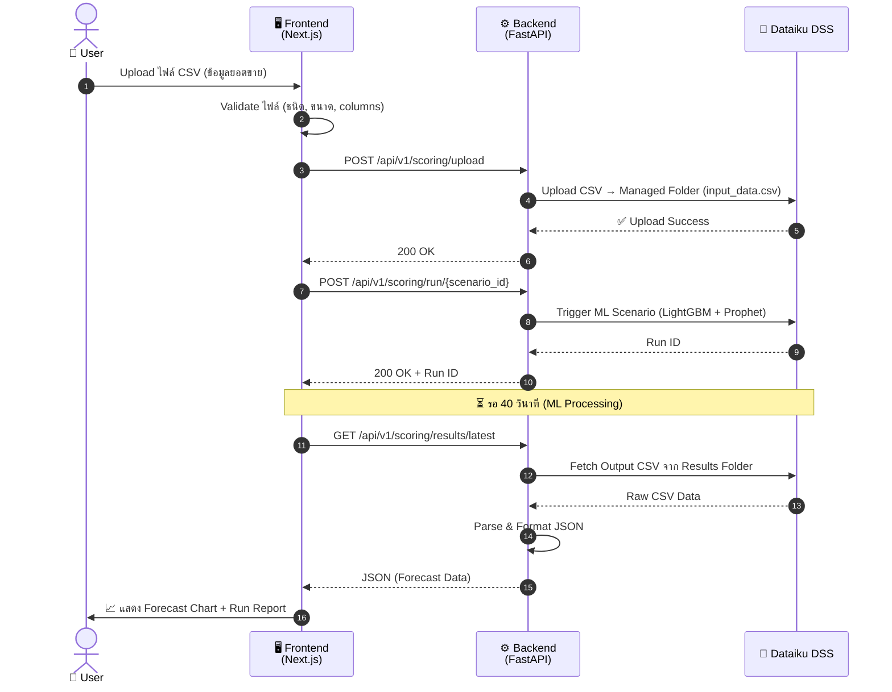
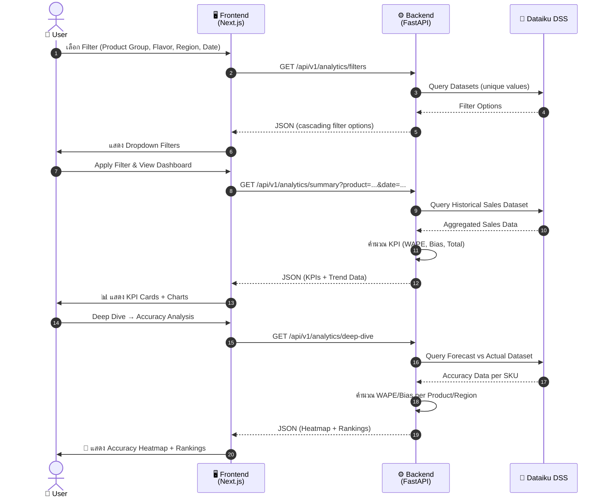
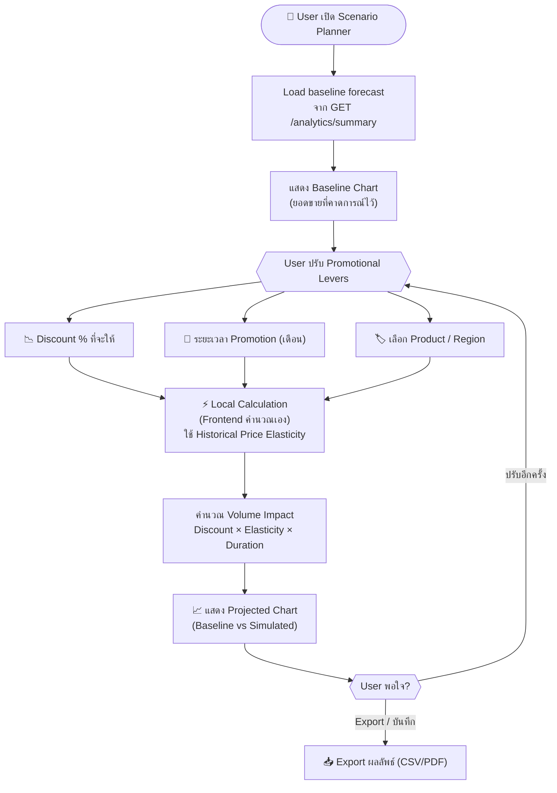
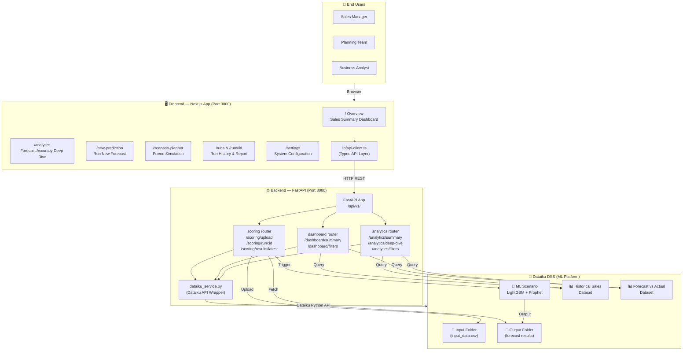

# 🍍 Malee Demand Forecasting Platform — Architecture Flow

> **สำหรับทีม Sales**: เอกสารนี้อธิบาย flow การทำงานของระบบ ทั้งในระดับ High-Level (ภาพรวม) และ Low-Level (รายละเอียดการทำงานภายใน)

---

## 📐 High-Level Architecture

ระบบแบ่งออกเป็น **3 ชั้น (3-Tier Architecture)** ที่สื่อสารกันผ่าน API

```mermaid
graph LR
    User(["👤 Business User\n(Sales / Planning Team)"])

    subgraph FE["🖥️ Frontend Layer\n(Next.js / React)"]
        direction TB
        P1["📊 Dashboard\n(Overview & Analytics)"]
        P2["🔮 Forecast\n(New Prediction)"]
        P3["🎯 Scenario Planner\n(Promo Simulation)"]
        P4["📋 Run History\n(Audit & Results)"]
    end

    subgraph BE["⚙️ Backend Layer\n(Python / FastAPI)"]
        direction TB
        R1["Analytics Router"]
        R2["Scoring Router"]
        R3["Dashboard Router"]
    end

    subgraph DS["🧠 Dataiku DSS\n(AI/ML Platform)"]
        direction TB
        D1["📁 Managed Folders\n(Input / Output CSV)"]
        D2["🤖 ML Scenarios\n(LightGBM + Prophet)"]
        D3["📦 Datasets\n(Historical Data)"]
    end

    User -->|"ใช้งานผ่าน Browser"| FE
    FE -->|"REST API (HTTP/JSON)"| BE
    BE -->|"Dataiku Python API"| DS

    style FE fill:#dbeafe,stroke:#2563eb,color:#1e3a8a
    style BE fill:#dcfce7,stroke:#16a34a,color:#14532d
    style DS fill:#f3e8ff,stroke:#9333ea,color:#581c87
```

### 🗺️ Component Summary

| Layer | Technology | หน้าที่หลัก |
|-------|-----------|------------|
| **Frontend** | React 19, Next.js 16, TypeScript, Tailwind CSS, Recharts | UI / UX, Data Visualization, User Interaction |
| **Backend** | Python FastAPI, Uvicorn, Pandas | Business Logic, API Gateway, Data Processing |
| **Dataiku DSS** | LightGBM, Prophet, Managed Folders | ML Model Training & Inference, Data Storage |

---

## 🔄 Low-Level Flow — Forecast Execution (New Prediction)

flow หลักที่ใช้เวลา user อยากรัน forecast ใหม่ด้วยข้อมูลของตัวเอง

---

## 📊 Low-Level Flow — Analytics & Dashboard

flow สำหรับการดู KPI และวิเคราะห์ความแม่นยำของโมเดล (ไม่ต้องรัน ML ใหม่)

---

## 🎯 Low-Level Flow — Scenario Planner (Local Simulation)

flow สำหรับจำลองผลกระทบของ Promotion (ทำงาน **Local** ไม่ต้องผ่าน Backend ทุกครั้ง)

---

## 🏛️ Full System Map (Component Diagram)

---

## 💡 Key Value Propositions (สำหรับ Sales Pitch)

| Feature | What it does | Business Value |
|---------|-------------|----------------|
| 🔮 **Demand Forecasting** | รัน ML model ด้วย LightGBM + Prophet บน Dataiku | ลด Overstock / Stockout ด้วย AI |
| 📊 **Accuracy Analytics** | วัด WAPE & Bias แบบ real-time ตาม SKU / Region | ติดตามประสิทธิภาพโมเดลได้ตลอด |
| 🎯 **Scenario Planner** | จำลองผลจาก Promotion ก่อนตัดสินใจ | ช่วย Trade Marketing วางแผน Promotion |
| 📋 **Run History** | เก็บประวัติการรัน Forecast พร้อม Report | Audit trail ครบถ้วน |
| 🔗 **Dataiku Integration** | ต่อตรงกับ Dataiku DSS ผ่าน API | ใช้ Data Science Platform ที่มีอยู่ได้ทันที |
