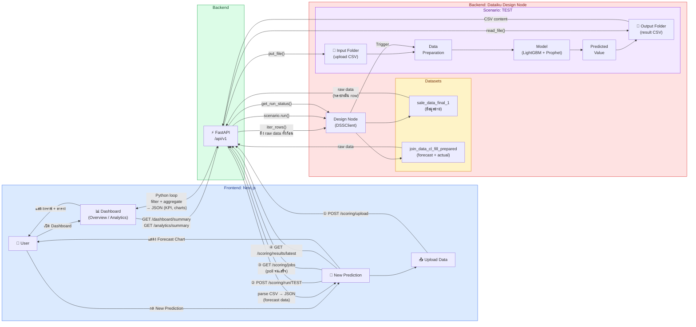
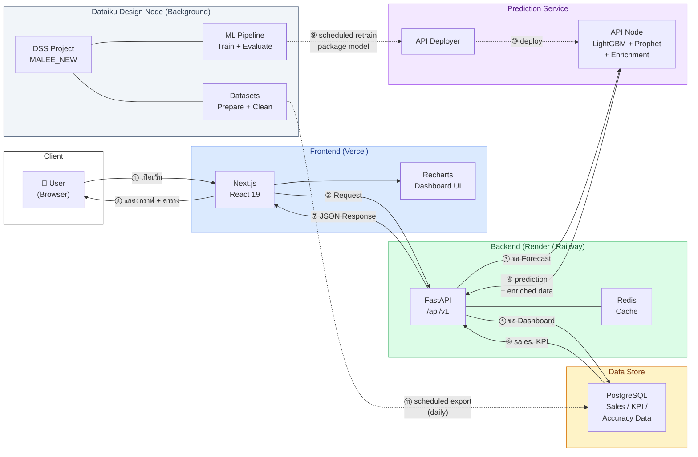
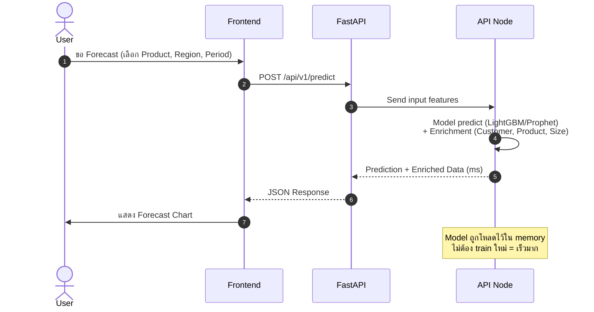
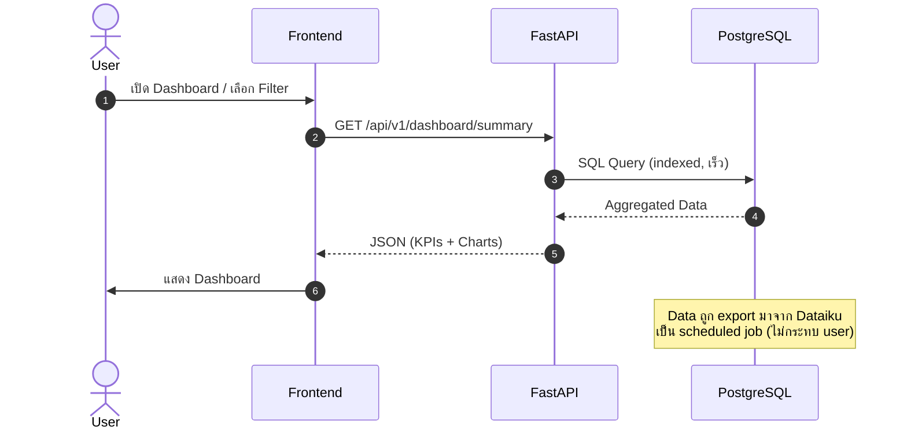
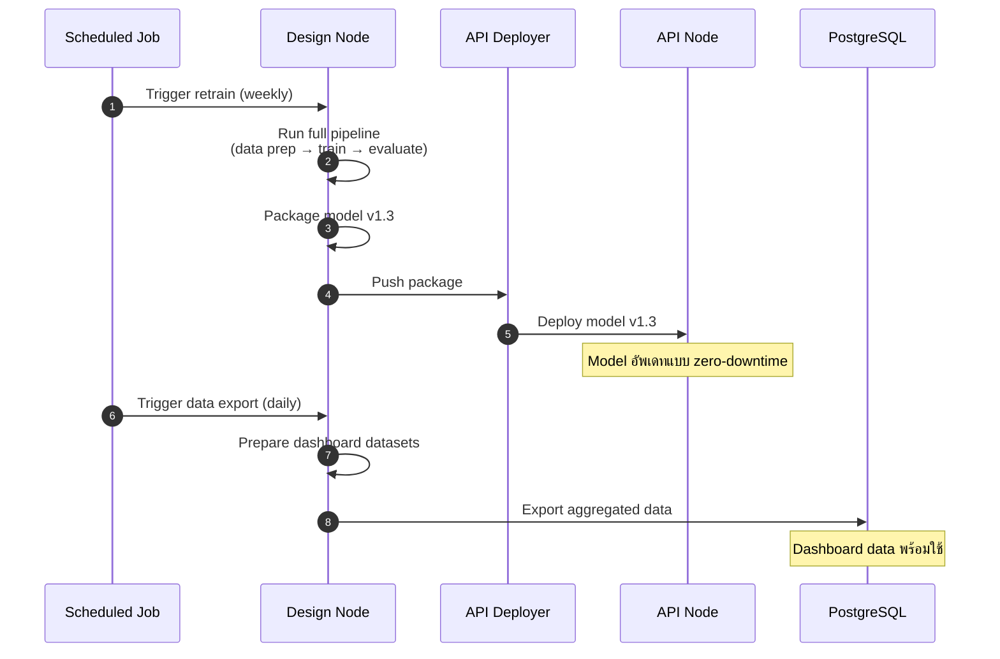

# Malee Demand Forecasting — Production Architecture Flow

> เปรียบเทียบ Demo (ปัจจุบัน) vs Production (แนะนำ)

---

## High-Level: Demo vs Production

### Demo (ปัจจุบัน) — ทุกอย่างผ่าน Design Node

**ปัญหา:** ช้า, รับ load ไม่ได้, scenario ชนกัน, security risk

---

### Production (แนะนำ)

**อ่านง่ายๆ:**
- **เส้นทึบ (→)** = ทาง user ใช้งานจริง (ทุก request)
- **เส้นประ (-..->)** = background job ทำเอง (scheduled, user ไม่เกี่ยว)

---

## Flow แยกตาม Use Case

### 1. Forecast Prediction

### 2. Dashboard & Analytics

### 3. Model Retrain & Data Update (Background — ไม่มี user เกี่ยว)

---

## สรุปเปรียบเทียบ

| | Demo (ตอนนี้) | Production (แนะนำ) |
|---|---|---|
| **Prediction** | Design Node run scenario ทุกครั้ง | API Node predict จาก model ใน memory |
| **Dashboard** | iter_rows() จาก Design Node | Query จาก PostgreSQL |
| **Retrain** | ทุกครั้งที่ user กด | Scheduled (weekly) |
| **Data update** | ดึงสดทุก request | Scheduled export ลง DB (daily) |
| **ความเร็ว** | นาที | มิลลิวินาที - วินาที |
| **รับ user** | 1-2 คน | หลายร้อยคนพร้อมกัน |
| **Security** | API key สิทธิ์เต็ม ตัวเดียว | แยก key ตาม role |
| **Design Node** | โดน user traffic ตรง | ไม่โดน traffic เลย (แค่ scheduled jobs) |

---

## ลำดับการ Upgrade (แนะนำ)

| Phase | ทำอะไร | ผลลัพธ์ |
|---|---|---|
| **Phase 1** | ย้าย dashboard data ลง PostgreSQL | Dashboard เร็วขึ้น, ลด load Design Node |
| **Phase 2** | Deploy model เป็น API Node + Enrichment | Predict เร็ว (วินาที), ไม่ต้อง run scenario |
| **Phase 3** | ตั้ง scheduled retrain + data export | อัพเดทอัตโนมัติ ไม่ต้อง manual |
| **Phase 4** | ย้าย API key เป็น env vars, แยก key ตาม role | Security |
| **Phase 5** | เพิ่ม Redis cache หน้า DB | รับ traffic สูงขึ้นอีก |
