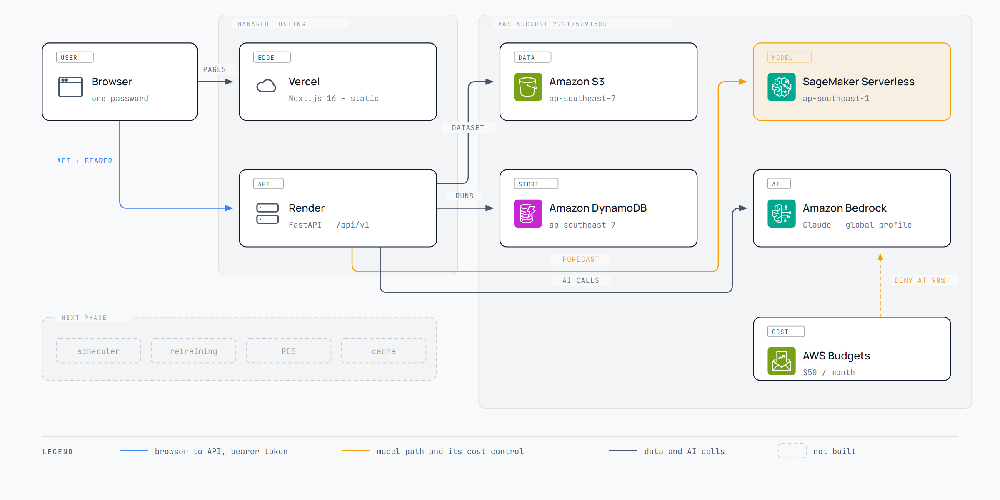

# Demand Forecasting Demo

A demand-forecasting and sales-analytics demo for a fast-moving consumer goods business, built on AWS. A Next.js front end on Vercel, a FastAPI back end on Render, and every data, model and AI service on AWS.



## What it does

- **Analytics** — actual sales by month, customer, site and product, filtered by product group, flavor, size, customer, mechanic and date range.
- **Plan Accuracy** — where the human Plan misses, as WAPE and Bias, with heatmaps, rankings and an error distribution. Promotion months are where it misses most, which is the point.
- **Forecast and Runs** — a Run executes the model over a 1, 3 or 6 month horizon and finishes in seconds. Every Run is kept with its accuracy, and any two can be compared.
- **Scenario Planner** — a baseline month against the same month with a promotion, and the per-feature contributions behind the difference.
- **AI features** — chat over the dashboard, insights, a written report, purchase-order extraction from an image or PDF, document question answering, and a multi-step agent. All on Claude through Amazon Bedrock.

## What runs where

| Piece | Where | Notes |
|---|---|---|
| Web app | Vercel | Next.js 16, static, behind one password |
| API | Render | FastAPI, `/api/v1`, called directly by the browser |
| Sales history | Amazon S3, ap-southeast-7 | one Parquet file, generated and seeded |
| Runs, uploads, documents | Amazon DynamoDB + S3, ap-southeast-7 | records as items, blobs as objects |
| Forecast model | SageMaker Serverless, ap-southeast-1 | LightGBM, scales to zero, see [ADR-0001](docs/adr/0001-serverless-inference-endpoint.md) and [ADR-0002](docs/adr/0002-endpoint-region-and-serving-container.md) |
| AI | Amazon Bedrock | Claude, three tiers switchable at runtime |
| Cost control | AWS Budgets | $50/month, revokes model invocation at 90% |

[How a Run and a prediction actually flow](docs/diagrams/data-flow.png).

## Run it locally

No AWS account and no credentials needed. Every backend defaults to a local implementation.

```bash
pip install -r requirements.txt
python -m backend.data.generator          # writes data/sales.parquet
python -m backend.model.train             # writes model/
python -m uvicorn backend.main:app --port 8080

cd malee-sales-app && npm install && npm run dev
```

The app is at http://localhost:3000 and the API at http://127.0.0.1:8080. With no `DEMO_PASSWORD` set the login page waves you straight through.

```bash
python -m pytest -q                       # 85 API tests through the HTTP seam, no AWS, no mocking library
cd malee-sales-app && npm run build
python -m pytest e2e -q                   # 26 browser tests: every sidebar page, login, a Run, a prediction
```

The browser suite starts its own API and web server on 8080 and 3000 from the build above, so stop any dev server on those ports first. It needs no AWS and no AI key; the AI pages are tested for loading and for failing visibly, not for answering.

## One switch per backend

Local and AWS differ only in configuration. Every switch lives in [`backend/config.py`](backend/config.py).

| Variable | Local | AWS |
|---|---|---|
| `DATA_SOURCE` | `local` | `s3` |
| `STORE_BACKEND` | `local` | `aws` |
| `MODEL_BACKEND` | `local` | `sagemaker` |
| `AI_BACKEND` | `gemini` | `bedrock` |

`MODEL_BACKEND=sagemaker` falls back to the in-process model whenever the endpoint is slow or absent, and says which path served each request in the log and on `/health/warm`.

## Where to look next

- [`CONTEXT.md`](CONTEXT.md) — the glossary. Product, Plan, Forecast, Mechanic, Promotion and Run each mean one thing, and names in code, API and UI follow it.
- [`docs/adr/`](docs/adr/) — decisions worth knowing before changing the model or the region.
- [`DEPLOYMENT.md`](DEPLOYMENT.md) — putting it on AWS, Render and Vercel, including the steps only the account owner can do.
- [`docs/runbook.md`](docs/runbook.md) — the fifteen minutes before a demo, the keep-alive loop during it, and what to do if the model is cold on stage.
- [`docs/architecture.md`](docs/architecture.md) — the two diagrams with what each box is and why.
- [`scripts/`](scripts/) — `aws_foundation.py` creates the bucket, table, backend user and budget; `aws_deploy.py` uploads the data and creates the endpoint.

Issues and specs live in this repository's GitHub Issues.
