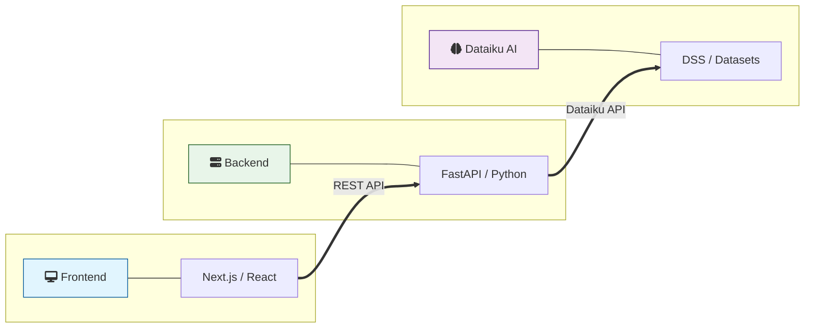
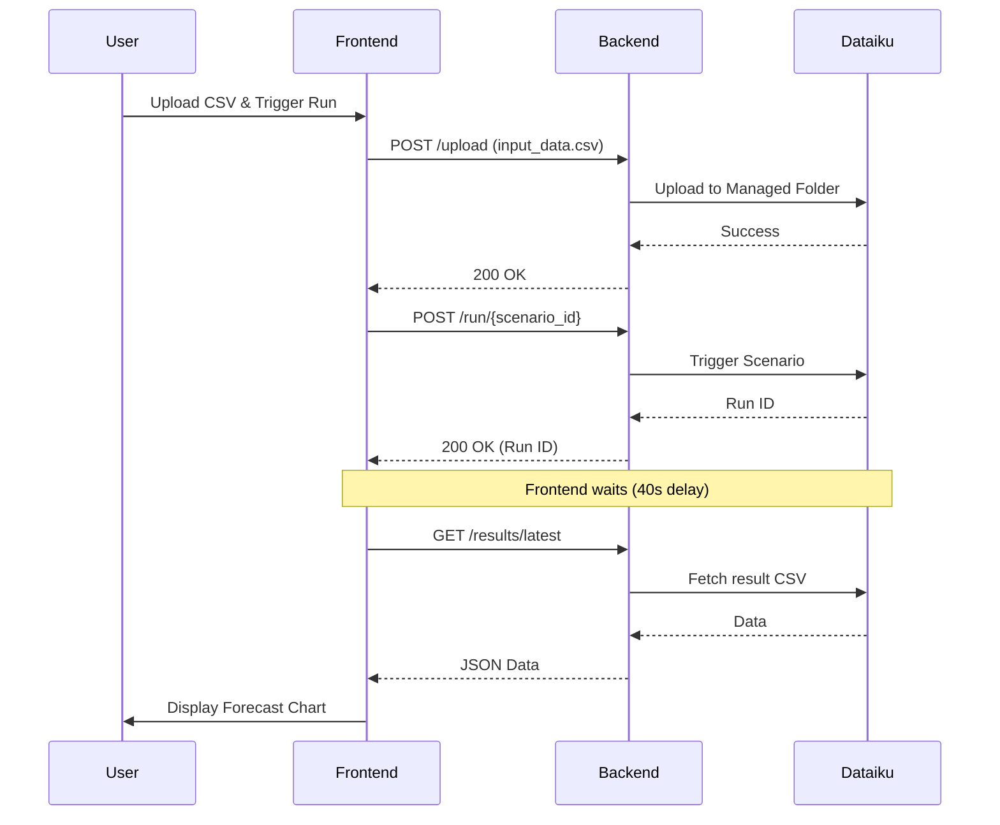

# Malee Sales App - Code Wiki

Welcome to the internal documentation for the **Malee Sales App**. This wiki provides a technical overview of the project's architecture, key components, and development workflows.

## 🚀 Project Overview
The Malee Sales App is a demand forecasting and sales analytics platform. It allows users to:
- Monitor historical sales performance across regions, customers, and flavors.
- Analyze forecast accuracy (WAPE, Bias) and deep-dive into performance drivers.
- Simulate promotional scenarios and run demand forecasts using Dataiku integration.

---

## 🛠 Tech Stack
| Tier | Technology |
| :--- | :--- |
| **Frontend** | React 19, Next.js 16 (App Router), TypeScript, Tailwind CSS 4, Recharts, Lucide React, Shadcn UI |
| **Backend** | Python 3.x, FastAPI, Uvicorn, Pandas, Dataiku API |
| **Data Science** | Dataiku DSS (Scenarios, Datasets, Managed Folders) |

---

## 🗺 System Architecture
The application follows a standard client-server architecture with an external Data Science platform (Dataiku) for heavy computation and data storage.

> [!TIP]
> **How to view this diagram:**
> If you are using **VS Code**, press `Ctrl + Shift + V` to preview the rendered diagram.
> The diagram below will automatically render into a visual flowchart on GitHub or any Mermaid-compatible viewer.



---

## 🔄 Forecast Execution Flow
This sequence diagram illustrates the process of uploading data and triggering a forecast.



---

## 📂 Project Structure

### Root Directory
- `backend/`: FastAPI source code and configurations.
- `malee-sales-app/`: Next.js frontend application.
- `requirements.txt`: Python dependencies.
- `DEPLOYMENT.md`: Infrastructure and deployment guides.
- `WIKI.md`: This documentation.

### Backend (`/backend`)
- `main.py`: Application entry point and router inclusion.
- `config.py`: Environment variables and Dataiku settings.
- `routers/`:
  - `analytics.py`: Advanced analytics and deep-dive logic.
  - `dashboard.py`: Summary KPIs and top product/customer trends.
  - `scoring.py`: Dataiku file uploads, scenario triggers, and results fetching.
- `services/`:
  - `dataiku_service.py`: Wrapper for Dataiku API interactions.
- `schemas/`: Pydantic models for request/response validation.

### Frontend (`/malee-sales-app`)
- `app/`: Next.js App Router pages (Overview, Analytics, Scenario Planner, etc.).
- `components/`: UI components organized by feature area.
  - `dashboard/`: KPI cards, regional charts, customer tables.
  - `planning/`: Trend charts, scenario simulators, filter bars.
  - `ui/`: Generic Shadcn/Radix components.
- `lib/`:
  - `api-client.ts`: Typed API service for frontend-backend communication.
  - `planning-context.tsx`: Shared state for scenario simulations.

---

## 🔌 API Documentation

### Analytics (`/api/v1/analytics`)
- `GET /summary`: Returns high-level KPIs and monthly sales trends. Supports filters for product group, flavor, customer, and date range.
- `GET /deep-dive`: Returns detailed accuracy metrics (WAPE, Bias), heatmaps, and performance rankings.
- `GET /filters`: Returns unique values for cascading filter dropdowns.

### Dashboard (`/api/v1/dashboard`)
- `GET /summary`: Returns standard dashboard metrics for historical performance.
- `GET /filters`: Returns unique filter values specific to the dashboard dataset.

### Scoring & Forecasting (`/api/v1/scoring`)
- `POST /upload`: Uploads a CSV file to a Dataiku managed folder for processing.
- `POST /run/{scenario_id}`: Triggers a specific Dataiku scenario (e.g., forecasting).
- `GET /jobs/{scenario_id}/{run_id}`: Polls for the status of a running scenario.
- `GET /results/latest`: Fetches the most recent forecast output from Dataiku.

---

## 📈 Key Workflows

### Running a New Forecast
1. **Upload Data**: User uploads a CSV file via `new-prediction` page.
2. **Trigger Scenario**: Frontend calls `POST /run/{scenario_id}`.
3. **Execution**: Dataiku processes the data. The frontend currently uses a 40-second fixed delay (simplified flow).
4. **Fetch Results**: Frontend calls `GET /results/latest` to display the forecast on the chart.

### Scenario Simulation
1. **Interactive UI**: Users adjust promotional levers (discount %, duration) in the Scenario Planner.
2. **Local Projection**: The UI projectively calculates the impact on volume using historical elasticities (managed via `planning-context.tsx`).

---

## 🛠 Development & Setup

### Backend Setup
```bash
# Install dependencies
pip install -r requirements.txt

# Run the server (default port 8080)
python -m backend.main
```

### Frontend Setup
```bash
cd malee-sales-app

# Install dependencies
npm install

# Run development server
npm run dev
```

---

## 🔒 Configuration
Configuration is managed via environment variables in `backend/config.py`. Key keys include:
- `DATAIKU_API_KEY`: Authentication for DSS.
- `DATAIKU_HOST`: URL of the Dataiku instance.
- `PROJECT_KEY`: The Dataiku project identifier.
- `FOLDER_ID`: Managed folder for input CSVs.
