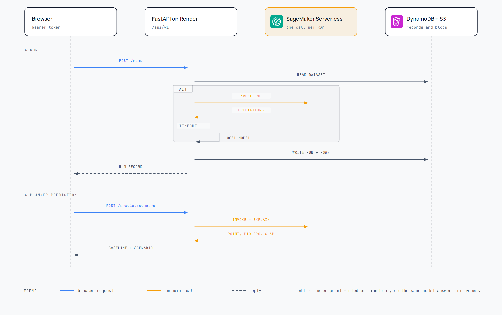

# Architecture

Two diagrams. The first is what exists; the second is what happens when someone clicks. Both are in this folder as HTML (open in a browser), SVG (for slides and Figma) and PNG.

## System

[HTML](diagrams/architecture.html) · [SVG](diagrams/architecture.svg) · [PNG](diagrams/architecture.png)

**The browser talks to two hosts.** Vercel serves the pages; the API calls go straight to Render with a bearer token rather than through a Next.js proxy, so a 20 MB upload does not have to pass through the edge.

**One password guards everything.** `POST /auth/login` trades `DEMO_PASSWORD` for an HMAC-signed token valid for twelve hours. Every route under `/api/v1` refuses without it, except health, login and the schema. The signing key is derived from the password, so changing the password invalidates every token already issued.

**Data and Runs are in Thailand.** The bucket and the DynamoDB table are in ap-southeast-7. The dataset is one Parquet file read straight into pandas through boto3. A Run's record is a DynamoDB item; its forecast rows are an S3 object, because a forecast grows with the horizon and a DynamoDB item stops at 400 KB.

**The model is one region away.** ap-southeast-7 does not offer Serverless Inference, and moving inference there would mean an instance billing around the clock. So the endpoint sits in ap-southeast-1 and scales to zero instead. A forecast request carries product, month and promotion attributes and no personal data. [ADR-0002](adr/0002-endpoint-region-and-serving-container.md) has the measurements and the alternatives.

**Cost cannot run away.** Everything is tagged `Project=demand-demo`. A $50 monthly budget filtered on that tag emails at 50, 75 and 90 percent, and at 90 percent attaches a policy that denies Bedrock and SageMaker invocation to the backend's IAM user. The endpoint costs nothing while idle, so there is nothing to remember to switch off.

**The greyed boxes are not built.** A scheduler, automated retraining, a relational database and a cache are all out of scope. They are on the diagram so nobody has to ask whether they were forgotten.

## A Run and a prediction

[HTML](diagrams/data-flow.html) · [SVG](diagrams/data-flow.svg) · [PNG](diagrams/data-flow.png)

**A Run is one endpoint call.** The backend builds a single feature frame covering every product across the horizon, the same rows without a promotion for the baseline, and the last six months for a backtest. That whole frame goes to the endpoint in one invocation. Splitting it per product would turn a two-second Run into a minute of cold starts.

**The fallback is the same model.** If the endpoint times out or errors, the identical LightGBM artifact answers in the API process. The handler and the in-process model read their feature order from the artifact and both compute explanations through LightGBM's own TreeSHAP, so the two paths cannot disagree — a test pins them together on the point, the interval and every contribution. The log names which path served each request, and `/health/warm` reports it.

**Accuracy is honest about its basis.** On the canonical dataset the model has seen every month, so a backtest would flatter it. Those Runs report the holdout accuracy measured at training time on months the model never saw. Runs on an uploaded file report the in-sample backtest and say so.

**A Planner prediction returns three things**: the baseline, the scenario with the promotion applied, and the per-feature contributions that explain the gap. The contributions sum to the prediction minus the model's base value, which is what makes the waterfall on the page add up.

## What is deliberately missing

Scheduled or automated retraining, any pipeline orchestration, SageMaker training or batch jobs, a relational database, a cache service, multi-user authentication, and infrastructure as code. Resources are created by the scripts in [`scripts/`](../scripts/), which is enough for a demo nobody will audit and small enough to read in one sitting.

## Regenerating the diagrams

The diagrams are authored as self-contained HTML with inline SVG, using the official AWS architecture icons and the app's own colour tokens. The SVG and PNG are exported from the HTML, so edit the HTML and re-export; do not hand-edit the SVG.
